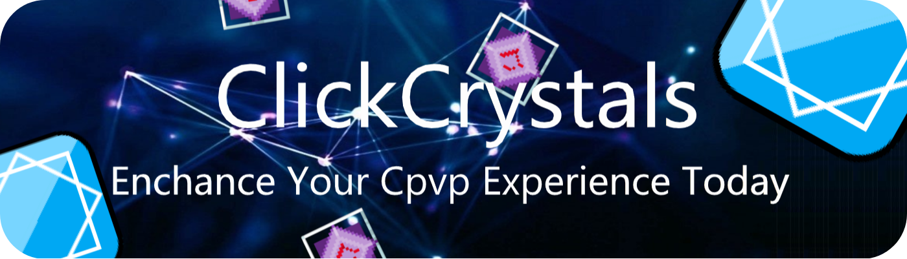

## Hello, I am ImproperIssues, I am also known as ItziSpyder.

My main language is Java.
<br>
I enjoy making random projects in my free time, with my favorite hobby being coding.
<br>
Projects that I release to the public are mainly for Minecraft.

#### Coding passion
As time went on I've been trying to improve upon my skillsets with each project, learning new aspects.
<br>
I had been keeping this up for around `1.5` years!

- Recently, I've been well known for the project [ClickCrystals](https://github.com/itzispyder/clickcrystals), receiving well over `35.0k` distributions on [Modrinth](https://modrinth.com/mod/clickcrystals); it counts as one of my most successful passion projects so far!

<br><br>
<div>
 <a href="https://itzispyder.github.io/clickcrystals">
  
 </a>
</div>

#### Wanna reach out?
```yml
My contacts:
 Discord: ImproperIssues#0
 Email: itzispyder@gmail.com
 IGN: ImproperIssues
 GitHub: ItziSpyder
 Modrinth: ItziSpyder
 PlanetMC: ImproperIssues
```


