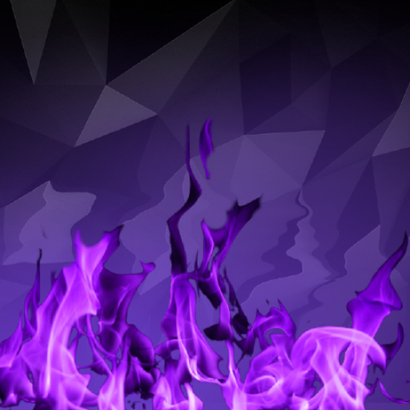

<!DOCTYPE html>
<html lang="en" class="main">
<head>
    <meta charset="UTF-8">
    <meta http-equiv="X-UA-Compatible" content="IE=edge">
    <meta name="viewport" content="width=device-width, initial-scale=1.0">
    <title>Improper | ItziSpyder</title>
    <link rel="stylesheet" href="./assets/css/index.css">
</head>
<body>
    <!--Story Cards-->
    

        <h1 id="header">Warping Between Space and Time</h1>
        
Hello, I'm a novice Minecraft Java developer and enjoys making mods and plugins. I find programming very entertaining and cannot wait to explore more languages!

    

    

        <h1 id="header">My Most Recent Projects!</h1>
        
I might be showcasing some of my recent projects here! My Discord is ImproperIssues#4988 if anyone wants to DM me!

    

    <a href="https://modrinth.com/mod/clickcrystals">
        

            
            <h1 id="header">ClickCrystals</h1>
            
Crystal PvP tweaks client mod. Your ultimate cpvp assistance. Various tweaks that improve your performance without ruining the cpvp experience.

        

    </a>
    <a href="https://discord.gg/ogre">
        

            
            <h1 id="header">OgreDupe</h1>
            
OgreDupe.minehut.gg, intense LifeSteal server with /dupe, friendly staff, join now!

        

    </a>
    <a href="https://github.com/itzispyder">
        

            
            <h1 id="header">Visit my GitHub</h1>
            
I upload all of my projects here, along with their src code! Check them out!

        

    </a>
    <a href="https://www.spigotmc.org/members/itzispyder.1635590/">
        

            
            <h1 id="header">My Spigot/Paper Plugins</h1>
            
I upload all of my public plugins for Spigot/Paper plugins here!

        

    </a>
    <a href="https://discord.gg/pmsas6yeCN">
        

            
            <h1 id="header">Join My Discord</h1>
            
Join us to discuss about development together or just gaming in general!

        

    </a>

    <!--Images and Effects-->
    

        
    

    

        

        

        

        

        

        

        

        

        

        

    

</body>

</html>
